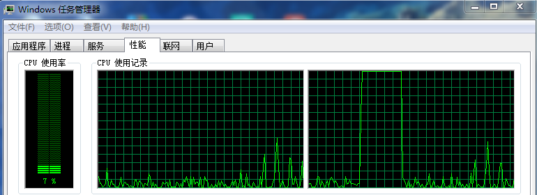

# ThreadAffinity
Thread CPU Affinity test
Update "golang.org/x/sys/windows"
```go
procGetCurrentThread                   = modkernel32.NewProc("GetCurrentThread")
procSetThreadAffinityMask              = modkernel32.NewProc("SetThreadAffinityMask")

func GetCurrentThread() (pseudoHandle Handle, err error) {
	r0, _, e1 := syscall.Syscall(procGetCurrentThread.Addr(), 0, 0, 0, 0)
	pseudoHandle = Handle(r0)
	if pseudoHandle == 0 {
		if e1 != 0 {
			err = errnoErr(e1)
		} else {
			err = syscall.EINVAL
		}
	}
	return
}

func SetThreadAffinityMask(s Handle, threadAffinityMask uint64) (err error) {
	r1, _, e1 := syscall.Syscall(procSetThreadAffinityMask.Addr(), 2, uintptr(s), uintptr(threadAffinityMask), 0)
	if r1 == 0 {
		if e1 != 0 {
			err = errnoErr(e1)
		} else {
			err = syscall.EINVAL
		}
	}
	return
}
```
## cpu use


